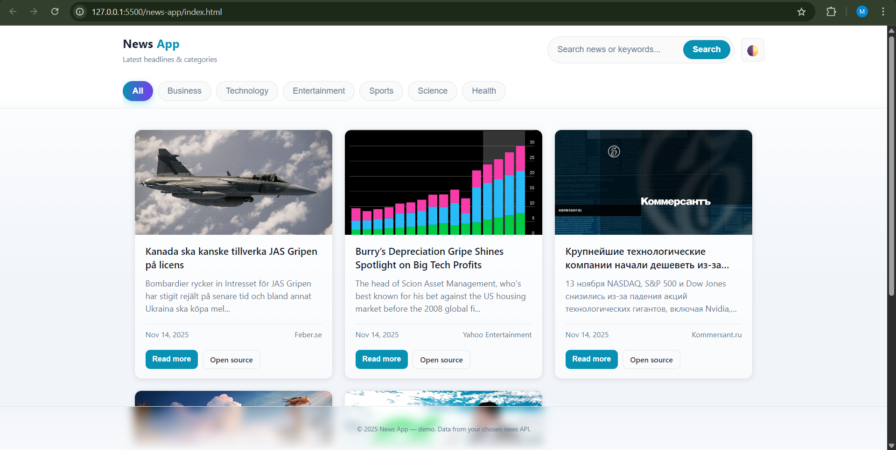
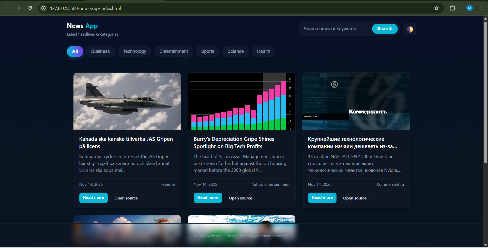
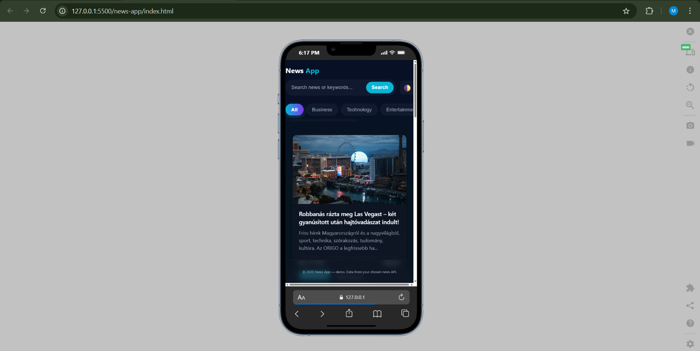

# 📰 News App

A modern, responsive news application built with vanilla JavaScript that fetches and displays the latest news articles from NewsAPI.org. Features include category filtering, search functionality, and a beautiful dark/light theme.


## ✨ Features

- 🔍 **Search Functionality** - Search news by keywords
- 📑 **Category Filtering** - Browse news by categories (Business, Technology, Sports, etc.)
- 🎨 **Dark/Light Theme** - Toggle between dark and light modes
- 📱 **Responsive Design** - Works seamlessly on desktop, tablet, and mobile
- 🚀 **Infinite Scroll** - Load more articles with a button click
- 🖼️ **Article Modal** - Read article details in a beautiful modal
- ⚡ **Fast & Lightweight** - No heavy frameworks, pure vanilla JavaScript
- 🎭 **Modern UI** - Glassmorphism design with smooth animations

## 🛠️ Tech Stack

### Frontend
- **HTML5** - Semantic markup
- **CSS3** - Modern styling with CSS Grid & Flexbox
- **JavaScript (ES6+)** - Vanilla JS with ES Modules
- **Fetch API** - HTTP requests

### Backend
- **Node.js** - JavaScript runtime
- **Express.js** - Web framework
- **CORS** - Cross-origin resource sharing
- **node-fetch** - HTTP client for Node.js

## 📁 Project Structure

```
news-app/
├── backend/
│   ├── server.js           # Express server with NewsAPI integration
│   ├── package.json        # Backend dependencies
│   └── package-lock.json
├── src/
│   ├── js/
│   │   ├── api.js         # API layer - HTTP requests
│   │   ├── ui.js          # UI layer - DOM manipulation
│   │   └── main.js        # Main controller - Event handlers
│   └── style/
│       └── styles.css     # Application styles
├── index.html             # Main HTML file
├── .gitignore
└── README.md
```

## 🚀 Getting Started

### Prerequisites

- Node.js (v14 or higher)
- npm or yarn
- NewsAPI.org API key (free tier available)

### Installation

1. **Clone the repository**
   ```bash
   git clone https://github.com/MuhammadChairulHamsy/news-app
   cd news-app
   ```

2. **Install backend dependencies**
   ```bash
   cd backend
   npm install
   ```

3. **Get your NewsAPI key**
   - Go to [NewsAPI.org](https://newsapi.org/)
   - Sign up for a free account
   - Copy your API key

4. **Configure API key**
   - Open `backend/server.js`
   - Replace `API_KEY` with your NewsAPI key:
   ```javascript
   const API_KEY = "your_api_key_here";
   ```

5. **Start the backend server**
   ```bash
   npm start
   ```
   The server will run on `http://localhost:5000`

6. **Open the frontend**
   - Option 1: Use VS Code Live Server extension
   - Option 2: Open `index.html` directly in your browser
   - Option 3: Use any local server (e.g., `python -m http.server 8000`)

### Configuration

If your frontend runs on a different port, update the CORS origin in `backend/server.js`:

```javascript
app.use(
  cors({
    origin: "http://127.0.0.1:5500", // Change this to your frontend URL
  })
);
```

## 📖 Usage

### Search News
1. Type keywords in the search bar
2. Press Enter or click the "Search" button
3. Articles matching your query will be displayed

### Filter by Category
1. Click on any category chip (Business, Technology, Sports, etc.)
2. Articles from that category will be loaded

### View Article Details
1. Click "Read more" on any article card
2. A modal will open with full article details
3. Click "Read full article" to open the source website

### Load More Articles
1. Scroll to the bottom
2. Click "Load more" button to fetch additional articles

### Toggle Theme
1. Click the 🌓 icon in the header
2. Theme preference is saved to localStorage

## 🔧 API Endpoints

### Backend API

#### Get News
```
GET /api/news?q={query}
```

**Parameters:**
- `q` (string, optional) - Search query or category. Default: "tesla"

**Response:**
```json
{
  "status": "ok",
  "totalResults": 100,
  "articles": [
    {
      "source": { "name": "TechCrunch" },
      "title": "Article Title",
      "description": "Article description",
      "url": "https://...",
      "urlToImage": "https://...",
      "publishedAt": "2025-11-14T10:00:00Z",
      "content": "Full content..."
    }
  ]
}
```

## 🎨 Customization

### Change Color Scheme
Edit CSS variables in `src/style/styles.css`:

```css
:root {
  --bg: #0f1724;        /* Background color */
  --card: #0b1220;      /* Card background */
  --accent: #06b6d4;    /* Accent color (cyan) */
  --text: #e6eef8;      /* Text color */
  /* ... more variables */
}
```

### Add More Categories
Edit the category buttons in `index.html`:

```html
<button class="chip" data-category="your-category">Your Category</button>
```

### Change Default News Topic
Edit the initial load in `src/js/main.js`:

```javascript
loadNews("your-topic", "general");
```

## 🐛 Troubleshooting

### Backend not working
- Check if Node.js is installed: `node --version`
- Verify backend is running: `curl http://localhost:5000/api/news?q=test`
- Check your NewsAPI key is valid
- Ensure you haven't exceeded NewsAPI rate limits (free tier: 100 requests/day)

### CORS errors
- Update the `origin` in `backend/server.js` to match your frontend URL
- Make sure backend server is running before opening frontend

### No articles displayed
- Open browser console (F12) to check for errors
- Verify API key is correct in `server.js`
- Check your internet connection
- Try a different search query (some topics may have limited results)

## 📝 License

This project is licensed under the ISC License.

## 👨‍💻 Author

**Your Name**
- GitHub: [@MuhammadChairulHamsy](https://github.com/MuhammadChairulHamsy)
- Email: mach.hamsy@gmail.com

## 🙏 Acknowledgments

- [NewsAPI.org](https://newsapi.org/) - News data provider
- [Express.js](https://expressjs.com/) - Backend framework
- Design inspiration from modern news websites

## 🔮 Future Enhancements

- [ ] Add pagination with page numbers
- [ ] Implement article bookmarking
- [ ] Add social media sharing
- [ ] Multi-language support
- [ ] Save reading history
- [ ] Add news sources filter
- [ ] Implement progressive web app (PWA)
- [ ] Add unit tests
- [ ] Deploy to production (Vercel/Netlify + Backend on Railway/Render)

## 📸 Screenshots

### Light View


### Dark View


### Mobile View


---

⭐ If you find this project useful, please give it a star on GitHub!

**Happy Reading! 📰✨**